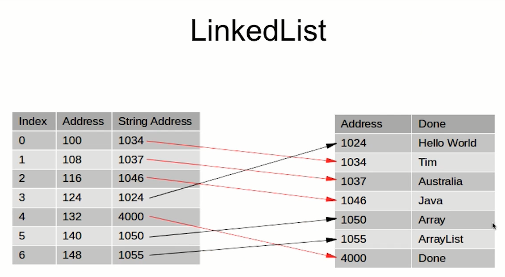
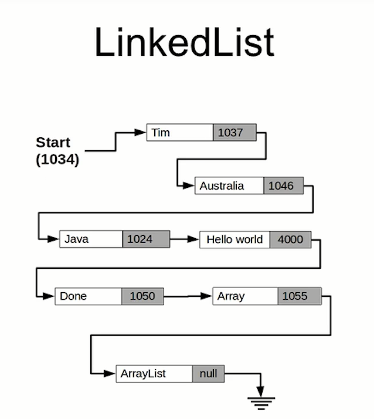
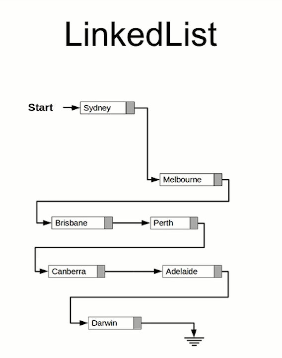
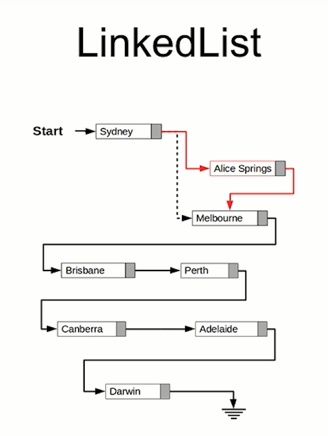
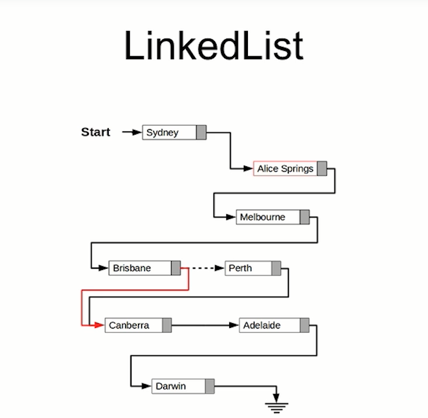

= Good to know about LinkedList

Each element in the list actually holds a link to the item that follows it, as well as the actual value you are wanting to actually store as well!

The original ArrayList:

LinkedList:

Original LinkedList with places:

Adding new place to LinkedList (we don't have to move any item down! to make room for the new item ...):

see LinkedList bellow after inserting the new item:

We insert the new item, and Sydney gonna point to Alice Springs and Alice Springs to Melbourne, so item is inserted!

Removing element as follows:

we have to point Brisbane to Canberra (instead of Perth! ...) it means it is removed! Perth will be still pointing to Canberra, but nothing refers to Perth that means the Object will be destroyed by JAVA garbage collector.